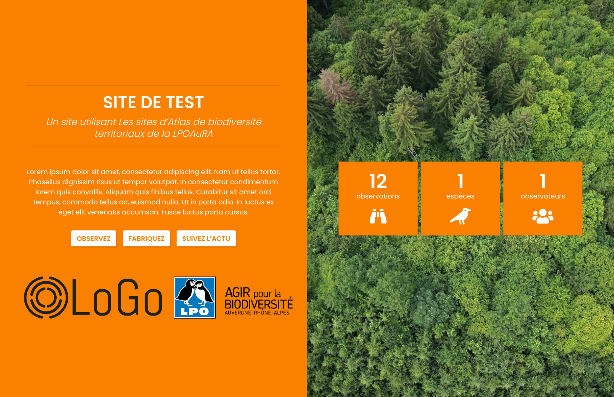
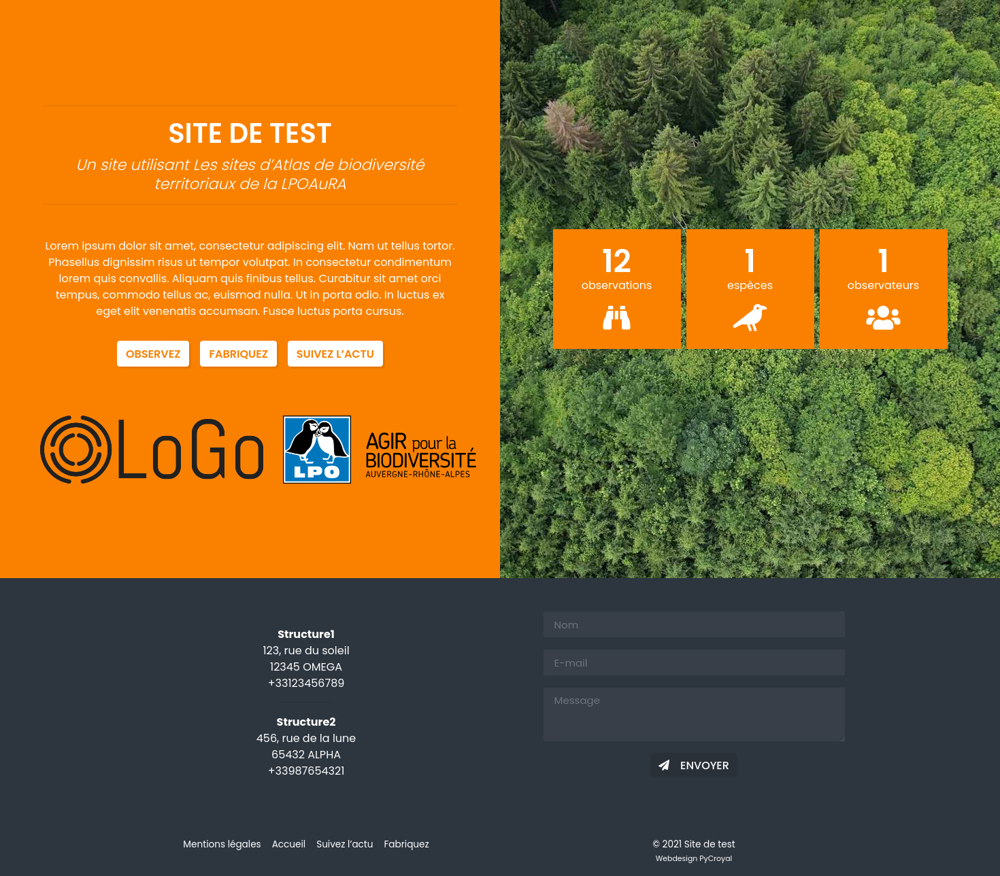
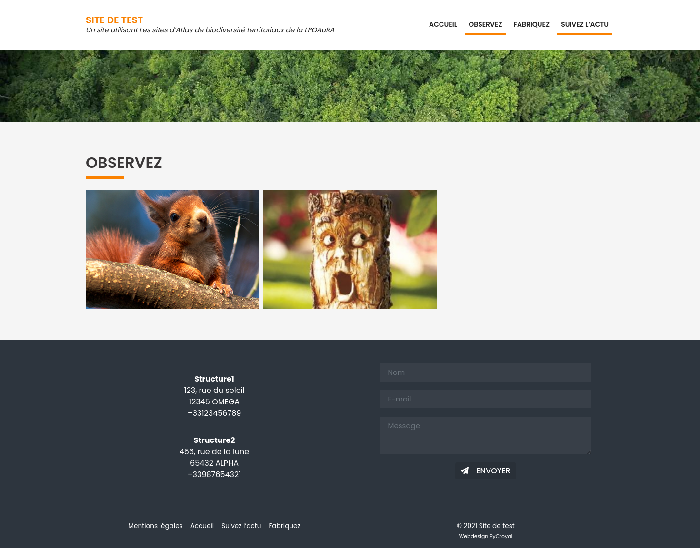
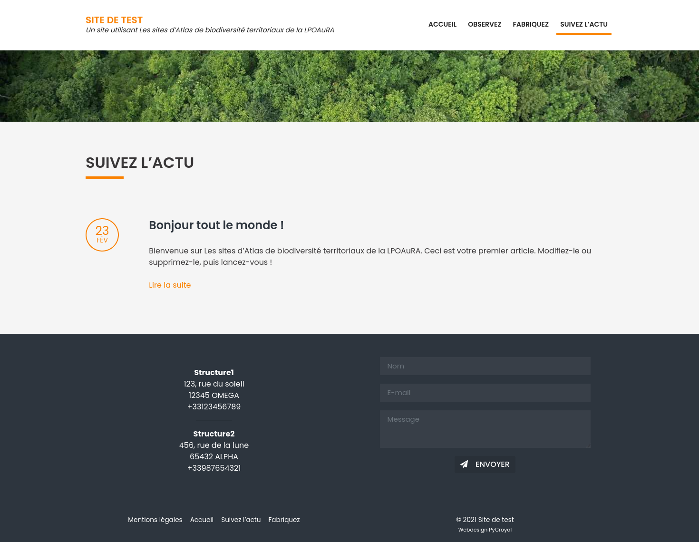

# wp-obsbiodiv-theme

Wordpress Theme to accompany GeoNature-citizen (communication tool for the general public) in multisite WordPress instance

## Installation

see [INSTALL.md](INSTALL.md)

## Screenshots

## Licence

Actually not defined 

## Team

* [Pierre-Yves Croyal](https://www.pycroyal.fr/), main developper
* [@lpofredc](https://github.com/lpofredc/) ([LPO Auvergne-Rhône-Alpes](https://github.com/lpoaura/)), project manager
* [@lpojgc](https://github.com/lpojgc/) ([LPO Auvergne-Rhône-Alpes](https://github.com/lpoaura/)), project supervisor

